# Service Dependency Graph
## University Management System (UMS)

---

## 1. Project Reference Graph

```mermaid
graph TD
    SK[UMS.SharedKernel]
    SD[ServiceDefaults]

    subgraph Identity
        ID[Identity.Domain] --> SK
        IA[Identity.Application] --> ID
        II[Identity.Infrastructure] --> IA
        II --> ID
        IAPI[Identity.API] --> IA
        IAPI --> II
        IAPI --> SD
    end

    subgraph Academic
        AcD[Academic.Domain] --> SK
        AcA[Academic.Application] --> AcD
        AcI[Academic.Infrastructure] --> AcA
        AcI --> AcD
        AcAPI[Academic.API] --> AcA
        AcAPI --> AcI
        AcAPI --> SD
    end

    subgraph Student
        StD[Student.Domain] --> SK
        StA[Student.Application] --> StD
        StI[Student.Infrastructure] --> StA
        StI --> StD
        StAPI[Student.API] --> StA
        StAPI --> StI
        StAPI --> SD
    end

    subgraph Attendance
        AtD[Attendance.Domain] --> SK
        AtA[Attendance.Application] --> AtD
        AtI[Attendance.Infrastructure] --> AtA
        AtI --> AtD
        AtAPI[Attendance.API] --> AtA
        AtAPI --> AtI
        AtAPI --> SD
    end

    subgraph Examination
        ExD[Examination.Domain] --> SK
        ExA[Examination.Application] --> ExD
        ExI[Examination.Infrastructure] --> ExA
        ExI --> ExD
        ExAPI[Examination.API] --> ExA
        ExAPI --> ExI
        ExAPI --> SD
    end

    subgraph Fee
        FD[Fee.Domain] --> SK
        FA[Fee.Application] --> FD
        FI[Fee.Infrastructure] --> FA
        FI --> FD
        FAPI[Fee.API] --> FA
        FAPI --> FI
        FAPI --> SD
    end

    subgraph Faculty
        FacD[Faculty.Domain] --> SK
        FacA[Faculty.Application] --> FacD
        FacI[Faculty.Infrastructure] --> FacA
        FacI --> FacD
        FacAPI[Faculty.API] --> FacA
        FacAPI --> FacI
        FacAPI --> SD
    end

    subgraph Hostel
        HD[Hostel.Domain] --> SK
        HA[Hostel.Application] --> HD
        HI[Hostel.Infrastructure] --> HA
        HI --> HD
        HAPI[Hostel.API] --> HA
        HAPI --> HI
        HAPI --> SD
    end

    subgraph Notification
        ND[Notification.Domain] --> SK
        NA[Notification.Application] --> ND
        NI[Notification.Infrastructure] --> NA
        NI --> ND
        NAPI[Notification.API] --> NA
        NAPI --> NI
        NAPI --> SD
    end

    subgraph Platform
        GW[ApiGateway] --> SD
        BFF[BFF] --> SD
    end

    subgraph Governance
        AG[Aegis.Core] --> SK
        CLI[Ums.Cli] --> AG
    end
```



---

## 2. Runtime Dependency Matrix

Services communicate at runtime only via Kafka (async) or HTTP through the API Gateway (never peer-to-peer).

| Service | Depends on (runtime) | Produces (Kafka) | Consumes (Kafka) |
|---------|---------------------|-----------------|-----------------|
| Identity | PostgreSQL, Kafka | `identity-events` | — |
| Academic | PostgreSQL, Kafka | `academic-events` | — |
| Student | PostgreSQL, Kafka | `student-events` | — |
| Attendance | PostgreSQL, Kafka | `attendance-events` | — |
| Examination | PostgreSQL, Kafka | `examination-events` | — |
| Fee | PostgreSQL, Kafka | `fee-events` | — |
| Faculty | PostgreSQL, Kafka | `faculty-events` | — |
| Hostel | PostgreSQL, Kafka | `hostel-events` | — |
| Notification | PostgreSQL, Kafka | `notification-events` | `identity-events`, `student-events`, `academic-events`, `fee-events`, `examination-events` |
| ApiGateway | All 9 services (HTTP proxy) | — | — |
| BFF | ApiGateway (HTTP) | — | — |

---

## 3. Infrastructure Dependency Map

```
Each Service API
    └──► PostgreSQL (own database, own schema)
    └──► Kafka (shared cluster, own topic)
    └──► Seq (log shipping via Serilog OTLP sink)
    └──► Jaeger (trace export via OTLP)

ApiGateway
    └──► All 9 services (ClusterIP DNS in K8s)
    └──► Seq, Jaeger

Notification
    └──► SMTP (email)
    └──► SMS gateway (stub)

Aegis CLI
    └──► Source code (static analysis, no runtime dependency)
```

---

## 4. Coupling Analysis

### Coupling Hotspots

| Area | Coupling Level | Notes |
|------|---------------|-------|
| SharedKernel ← all services | Low (intentional) | Only primitives; low-change |
| ServiceDefaults ← all APIs | Low (intentional) | Config plumbing only |
| Notification → Kafka topics | Medium | Consumes 5 topics; adding a 6th needs code change |
| OutboxRelayService pattern | High repetition | Duplicated in every service (9 copies) |
| DomainEventDispatcherInterceptor | High repetition | Duplicated in every service (9 copies) |
| KafkaConsumerBase | Medium | Base class in Notification.Infrastructure, not in SharedKernel |

### Cross-Service Coupling — Enforced Zero

Aegis `CrossServiceDirectReferenceRule` ensures:
- No service project directly references another service project
- No direct HTTP calls between services (must go via Kafka or through gateway)
- Violation → CI fail

---

## 5. Dependency Direction Violations (Known Issues)

Based on code analysis, the following patterns deviate from ideal:

| Issue | Location | Severity |
|-------|----------|----------|
| `OutboxRelayService` duplicated in 9 services | Each `*.Infrastructure` | Medium — extract to SharedKernel |
| `DomainEventDispatcherInterceptor` duplicated in 8 services | Each `*.Infrastructure` | Medium — extract to SharedKernel |
| `KafkaConsumerBase` lives in Notification.Infrastructure | Should be in SharedKernel | Medium |
| `MigrationHostedService` duplicated | Multiple API projects | Low — extract to ServiceDefaults |
| `GlobalExceptionMiddleware` duplicated | Multiple API projects | Low — extract to ServiceDefaults |
| `ValidationBehavior` / `ValidationBehaviour` naming mismatch | Student vs others | Low — naming inconsistency |

---

## 6. Recommended Dependency Improvements

```
SharedKernel (add)
├── Infrastructure/
│   ├── OutboxRelayServiceBase.cs     ← abstract base; services override GetDbContext()
│   ├── DomainEventDispatcherInterceptorBase.cs
│   └── KafkaConsumerBase.cs         ← moved from Notification.Infrastructure
└── Kafka/
    └── KafkaEventEnvelope.cs        ← already exists, ensure it's in SharedKernel

ServiceDefaults (add)
├── MigrationHostedService.cs        ← generic migration runner
└── GlobalExceptionMiddleware.cs     ← shared exception handling
```
